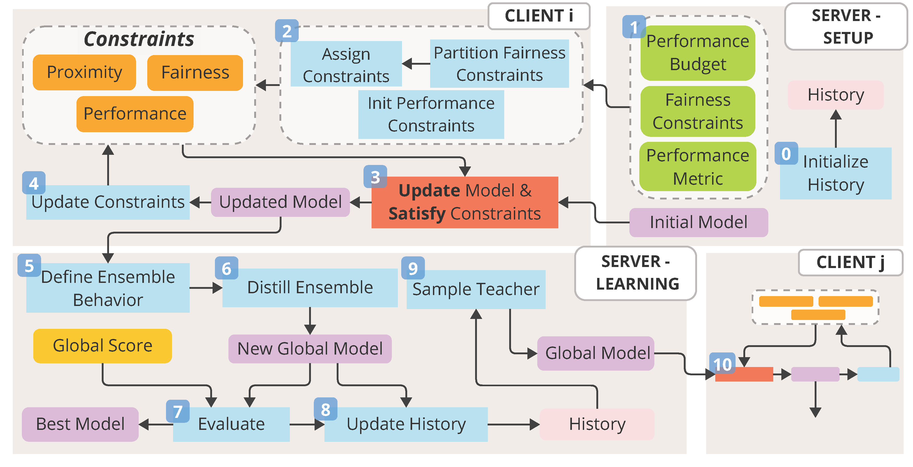

# FedFairLAB

**Federated Learning with Multiple, Intersectional and Multiclass Fairness Guarantees under Performance Budgets**

FedFairLAB is a **fairness-aware Federated Learning (FL) methodology** that enforces **group, intersectional, and multiclass fairness constraints** while explicitly controlling the **fairness–performance trade-off** through a tunable **performance budget**.

The method extends the FairLAB constrained optimization methodology to federated settings and combines it with **knowledge distillation–based aggregation**, making it robust to **non-IID client data** and suitable for realistic cross-silo FL scenarios.

---

## 🔍 Key Features

- **Fairness-aware Federated Learning**
  - Supports several fairness metrics, such as **Demographic Parity (DP)** and **Equalized Odds (EOD)**
- **Multiple fairness regimes**
  - Group fairness (e.g. Gender)
  - Intersectional fairness (e.g., Race × Gender)
  - Multiclass fairness (K > 2)
- **Simultaneous enforcement of multiple fairness constraints**
  
- **Explicit performance budget (β)**
  - Bounds the maximum acceptable degradation in predictive performance
- **Local and global fairness guarantees**
  - Fairness enforced at both client and federation level
- **Robust aggregation**
  - Knowledge distillation in logit space instead of parameter averaging
- **Non-IID ready**
  - Designed for heterogeneous and demographically skewed client data

---

## 🧠 Method Overview

FedFairLAB combines three main components:

1. **Augmented Lagrangian Method (ALM)**  
   Fairness constraints are formulated as differentiable constraints and optimized jointly with the task loss.

2. **Performance Budget (β)**  
   An explicit constraint that limits how much predictive performance (e.g., F1 or accuracy) can be sacrificed to improve fairness.

3. **Federated Knowledge Distillation**
   - Clients exchange **logits**, not parameters
   - Ensemble of local fair models is distilled into a global model
   - A *selective distillation mechanism* transfers knowledge only where the teacher is correct and the student errs

This design ensures **stable optimization**, **bounded utility loss**, and **fairness propagation across the federation**.

---